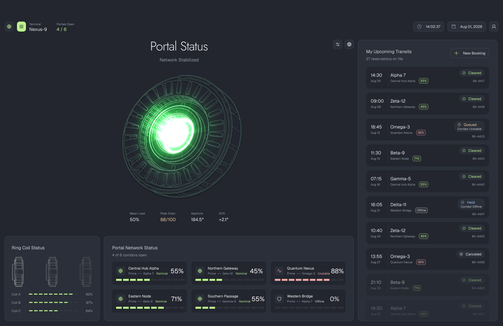
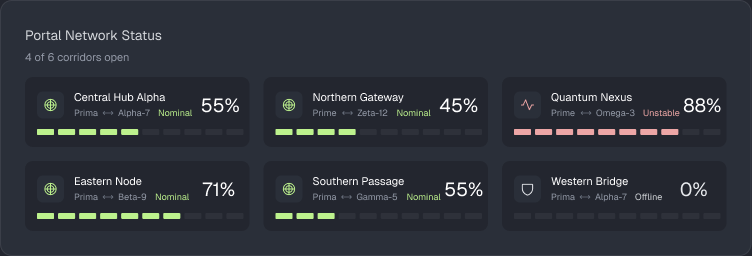
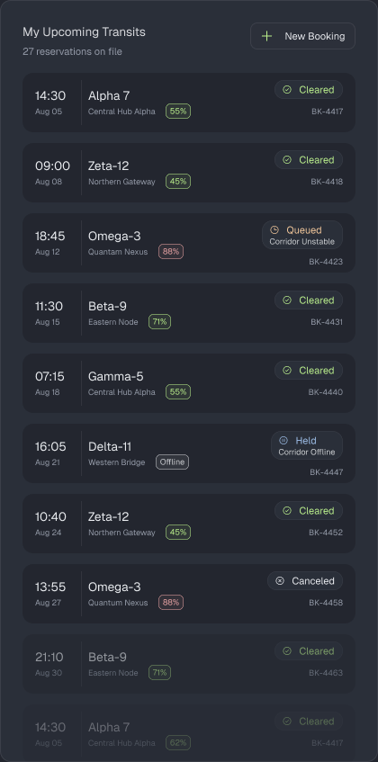

# Nexus Transit Authority: Operations Console Challenge

Terminal Nexus-9 moves travelers between worlds. Six portals hold six
corridors open around the clock, and a traveler who steps into one arrives
somewhere else entirely.

Corridors aren't reliable. Push enough traffic through one and its
containment field starts to wander. Lose containment altogether and the
corridor drops until the field cycles back up. None of this is visible
from the concourse: a portal about to fail looks exactly like one that's
fine.

The operator at the desk is the last check before someone steps through,
and right now they're working blind. No live view of the network, no list
of who's booked, no way to get a traveler onto the next departure.

That's the screen you're building.

You'll build an **operations console**: a web app that shows the live state
of the portal network, lists a traveler's upcoming transits, and lets them
book a new one. It talks over HTTP to a server we call the **Control
Tower**, which serves all the data you'll render.

**You have total freedom on implementation.** Any framework, any styling
approach, any state management, any build tooling, or none of it. The only
hard requirement is that your app talks to the Control Tower's HTTP/JSON
endpoints and runs from a single documented command.

Questions? Reach out to Dao (<ho.dao@northeastern.edu>).

---

## 0. Get your challenge repo before anything else

Go to `<CONTROL_TOWER_BASE_URL>/apply` and enter your name and GitHub username. This
creates a private repo for you under our org and adds you as a collaborator
with push access.

**This is the repo your submission must live in.** Don't create your own
repo instead. Work that doesn't end up in the repo created for you here
isn't reviewed. If you lose the link, submit your username again; it's safe
to repeat and just hands you back the same repo.

---

## 1. How this gets evaluated

Most of this isn't about whether you can build a dashboard. It's about the
decisions around it: what the UI does when a value is missing, when a
request fails, and when nobody has told you what the screen should look
like.

The two parts test opposite skills on purpose.

**Part 1 gives you a design.** We want to see execution: fidelity to a
spec, correct data handling, and pagination done properly.

**Part 2 gives you nothing but an API.** We want to see judgment: how you
structure a flow nobody described to you, and what you do when a request
fails.

Part 2 is smaller than Part 1, and weighted at least as heavily.

We read `DESIGN.md` as closely as the code. Two people can build the same
screen and have made completely different decisions getting there, and the
decisions are the part we can't see from the repo alone.

---

## 2. The problem

The six portals are Central Hub Alpha, Northern Gateway, Quantum Nexus,
Eastern Node, Southern Passage, and Western Bridge. Each is always in
exactly one of three states.

**Nominal.** Carrying traffic, containment steady, safe to walk through.

**Unstable.** Still open and still passing travelers, but close enough to
its containment ceiling that it might not stay that way. It hasn't failed.
It's telling you it might.

**Offline.** Containment has dropped. Nothing goes through until the field
cycles back up, and a portal not holding a corridor reports no load at all.

The network shifts on its own, hour by hour. Travelers hold reservations
booked weeks out: some cleared, some queued behind an unstable corridor,
some held outright. New departures open continuously.

Roughly one booking in three fails. The console is the only thing that
decides whether the traveler in front of you finds out.

---

## 3. Talking to the Control Tower

Base URL: `<CONTROL_TOWER_BASE_URL>`

**No authentication.** None of the endpoints in this challenge need a token
or a login. Ignore the `/register` and `/login` endpoints you'll see in the
API reference; those belong to the backend challenge.

**Interactive API reference:** `<CONTROL_TOWER_BASE_URL>/docs`
**Machine-readable spec:** `<CONTROL_TOWER_BASE_URL>/openapi.json`

The OpenAPI spec is generated from the server's own types, so it is always
accurate. You're welcome to generate a typed client from it rather than
hand-writing one.

### A note on CORS

If you run a dev server on its own port, the browser will block these
requests even though `curl` works fine. Configure a dev proxy or handle it
however you prefer; how you solve it isn't part of what we're evaluating.

---

## 4. Part 1: the operations dashboard

Build the dashboard in this Figma file:
**[Frontend Challenge: Operations Console](https://www.figma.com/design/EH8o0D4rym3OgwcoQ36GQa/Frontend-Challenge?node-id=3-7&t=jpMix9rA0sScwGMm-1)**



Match the design. Where it's ambiguous or doesn't cover a state you hit,
use your judgment and say so in `DESIGN.md`. We're not measuring pixels,
but every state the design shows should exist in what you build.

The Figma file is the source of truth for spacing, color and type; the
images here just show which panel each endpoint feeds.

### Portal Network Status



```
GET /frontend/portals
```

Returns all six portals:

```json
[
  { "name": "Central Hub Alpha", "status": "nominal",  "load": 55 },
  { "name": "Quantum Nexus",     "status": "unstable", "load": 88 },
  { "name": "Western Bridge",    "status": "offline",  "load": 0 }
]
```

- `status` is one of `nominal`, `unstable`, `offline`. It is derived from
  the portal's load and containment field. You never have to compute it,
  but you do have to render all three distinctly.
- `load` is a percentage between `0` and `100`. A portal can report
  `load: 0` while its `status` is `nominal`: that's a healthy corridor with
  nothing currently going through it. Zero load doesn't mean offline, so
  branch on `status`.
- The order of the array is fixed. Your layout should not reshuffle between
  polls.
- **Network state changes once an hour.** Polling more often than that
  returns identical data. Every hour is guaranteed to contain at least one
  portal in each state, so you will always have something to render for all
  three.

The `4 / 6 corridors open` count in the design isn't something the API
returns. Work it out from the data.

### My Upcoming Transits



Note the fade at the bottom of the list in the design: there are far more
reservations than fit on screen.

```
GET /frontend/bookings?limit=10&cursor=<opaque>
```

```json
{
  "items": [
    {
      "reference": "BK-4417",
      "departsAt": "2026-08-14T07:15:00Z",
      "destination": "Alpha-7",
      "portal": "Meridian Crossing",
      "load": 36,
      "status": "cleared"
    },
    {
      "reference": "BK-4422",
      "departsAt": "2026-08-20T13:55:00Z",
      "destination": "Zeta-12",
      "portal": "Tidewater Arch",
      "load": null,
      "status": "held",
      "statusDetail": "Corridor Offline"
    }
  ],
  "nextCursor": "MjAyNi0wOC0xN1QwOTowMDowMFp8QkstNDQxOQ",
  "hasMore": true,
  "total": 46
}
```

- `status` is one of `cleared`, `queued`, `held`, `canceled`.
  `statusDetail` is the secondary reason line and is absent when there
  isn't one.
- `load` is `null` when the corridor was offline and no reading was taken.
  That is different from a load of `0`.
- `total` is every booking on file, not just this batch. The reservations
  count in the design comes from here.

**Pagination is not optional.** `limit` is capped at `10`, and asking for
more returns `422`. There are far more bookings on file than that, so the
list has to be fetched in batches.

Every response includes a `nextCursor`, which marks where that batch ended.
Send it back as the `cursor` query parameter to get the batch after it, and
keep going until `hasMore` comes back `false`, at which point `nextCursor`
is omitted entirely.

The cursor is opaque: it encodes a position in the list, and the only
correct thing to do with it is send it back exactly as received. Don't
try to construct or modify one.

> The bookings list and the portal panel are **independent data sets**.
> Booking portal names are deliberately different from the six network
> portals, and a booking's `load` is a stored snapshot, not the live value.
> Don't spend time hunting for a correlation; there isn't one.

---

## 5. Part 2: the booking flow

Build a flow that lets a traveler book a transit.

**We are deliberately not telling you what this looks like.** How many
screens, in what order, what a booking form asks for, how a slot gets
picked, what happens after a confirmation: all of it is yours. There is no
mockup and no right answer. Design something you'd be willing to ship, and
explain your reasoning in `DESIGN.md`.

### Available slots

```
GET /frontend/slots
```

```json
[
  {
    "id": "SLOT-1000",
    "destination": "Alpha-7",
    "portal": "Meridian Crossing",
    "departsAt": "2026-08-13T06:00:00Z",
    "durationMinutes": 60,
    "seatsAvailable": 2,
    "fareCredits": 260
  }
]
```

The whole catalogue comes back in one request. There's no filtering or
pagination. How a traveler narrows it down is a design decision, not an
API call.

### Submitting a booking

```
POST /frontend/slots/{slotId}/book
```

```json
{
  "travelerName": "Ada Lovelace",
  "travelerCount": 2,
  "contactEmail": "ada@example.com",
  "notes": "window seat if the corridor allows",
  "metadata": { "anything": "your form collects" }
}
```

Only `travelerCount` is structurally required. `metadata` is a free-form
key/value bag. If your booking form asks for something we didn't
anticipate, put it there. We're not prescribing what a booking form should
contain.

**Every response has the same shape**, whether it worked or not:

```json
{
  "status": "confirmed",
  "slotId": "SLOT-1000",
  "detail": "booking confirmed",
  "retryable": false,

  "reference": "BK-68E204",
  "travelerCount": 2,
  "totalCredits": 520,
  "confirmedAt": "2026-08-12T03:48:23Z"
}
```

The last four fields are present **only** when `status` is `confirmed`.

| `status` | `retryable` | HTTP | What it means |
|---|---|---|---|
| `confirmed` | `false` | `200` | Booked. `reference` is the traveler's confirmation. |
| `slot_taken` | `false` | `200` | Someone else got it. This slot is gone. |
| `insufficient_seats` | `false` | `200` | Party is larger than `seatsAvailable`. |
| `corridor_unstable` | `true` | `503` | The booking never completed. The same request is still valid. |

`detail` is human-readable and safe to show a traveler as-is.

An unknown `slotId` returns `404` with a different body. That's a bug in
your client, not an outcome.

### This endpoint fails about 30% of the time, on purpose

That is the point of Part 2. You will hit it within a few minutes of
testing, and a flow that only handles the happy path will visibly fall
apart.

Handling it well means more than showing an error. What the traveler sees,
what happens to what they've entered, and what they can do next are all
decisions, and there's no single right answer to any of them.

### What's simulated

So you don't build against guarantees that don't exist:

- **Submissions are not persisted.** A confirmed booking won't appear in
  `GET /frontend/bookings`, and its reference won't resolve anywhere.
- **Inventory doesn't move.** Booking a slot never decrements
  `seatsAvailable`. `slot_taken` is simulated, not real contention.

Build as if these were real. We just don't want you debugging why a
confirmed booking didn't show up in the list.

---

## 6. What to submit

Your whole submission (code, `README.md`, `DESIGN.md`, all of it)
must live in the repo you got from `/apply` in §0.

1. **A working console** covering both parts, that runs from a single
   documented command.
2. **`README.md`**: setup and how to run it. Assume the reader has never
   seen your project before. Include a short screen recording of you
   clicking through both parts, so we can see the flow working without
   rebuilding your environment. A link is fine.
3. **`DESIGN.md`** (max 2 pages): not a tour of every component, but the
   thinking behind it:
   - **The flow you designed.** What shape did Part 2 take, and why that
     one? What did you consider and rule out?
   - **Failure from the traveler's side.** One booking in three fails.
     What do they see, and what can they do about it?
   - **What you left out**, and why that was the right call here rather
     than an omission.

Accessibility, responsiveness, and empty/loading states aren't graded
separately, but they're part of whether this reads as shippable.

---

## 7. If you're not sure where to start

1. **Get one endpoint rendering.** `GET /frontend/portals` returns six
   items and needs no auth or pagination. If you can render those six
   cards, your setup and CORS are solved.
2. **Then do the bookings list.** Pagination is the mechanical part of
   Part 1. Get the cursor loop terminating correctly before you style
   anything.
3. **Look at how the good ones do it.** You've booked flights, hotels,
   event tickets, restaurant tables. Go back through a few of those flows
   and pay attention to how they sequence the steps, what they ask for and
   when they ask for it, and how they behave when something goes wrong.
   The products that feel effortless got there deliberately. Take the
   structure that works instead of inventing one from scratch.
4. **Build Part 2's flow with the happy path only, briefly.** Just enough
   to submit successfully once.
5. **Then break it on purpose.** Submit repeatedly until you've seen all
   four outcomes, and fix what falls over.
6. **Write `DESIGN.md` as you go, not at the end.** It's easier to record
   your reasoning in the moment than to reconstruct it, and it reads more
   honestly for it.
